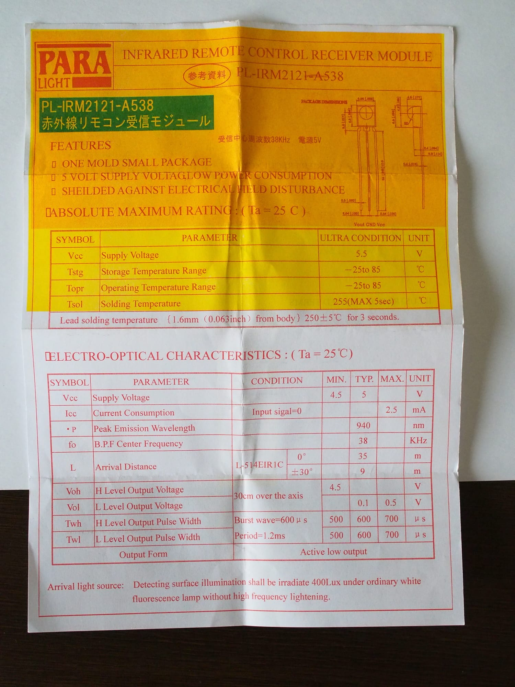
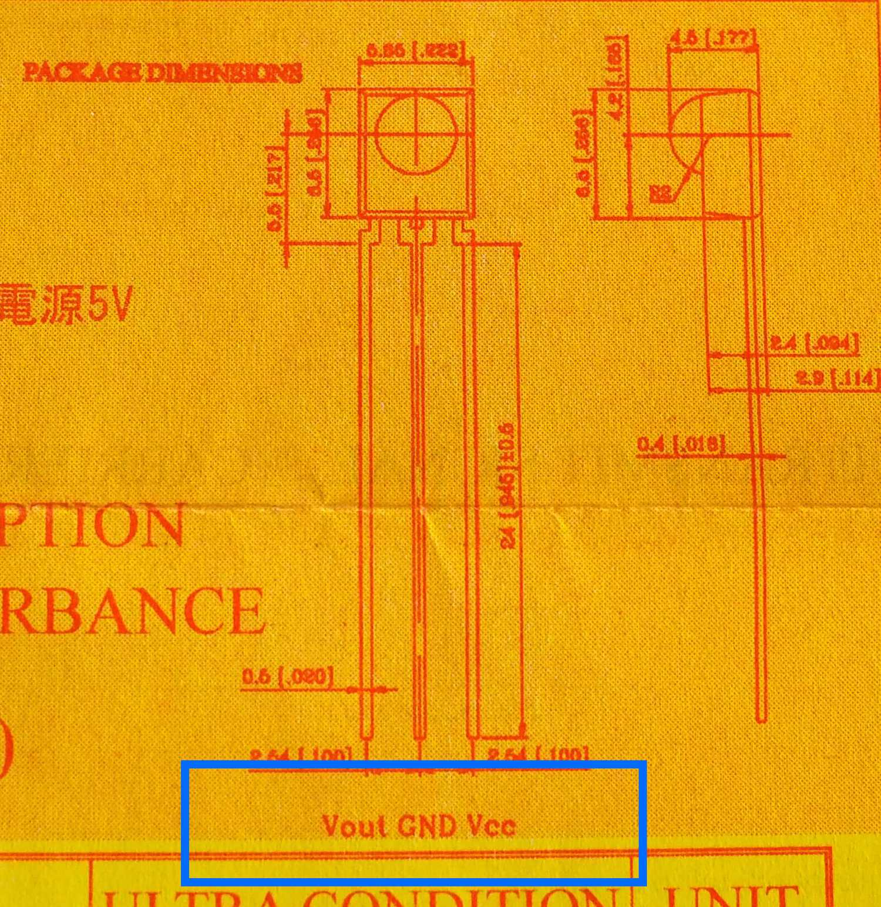
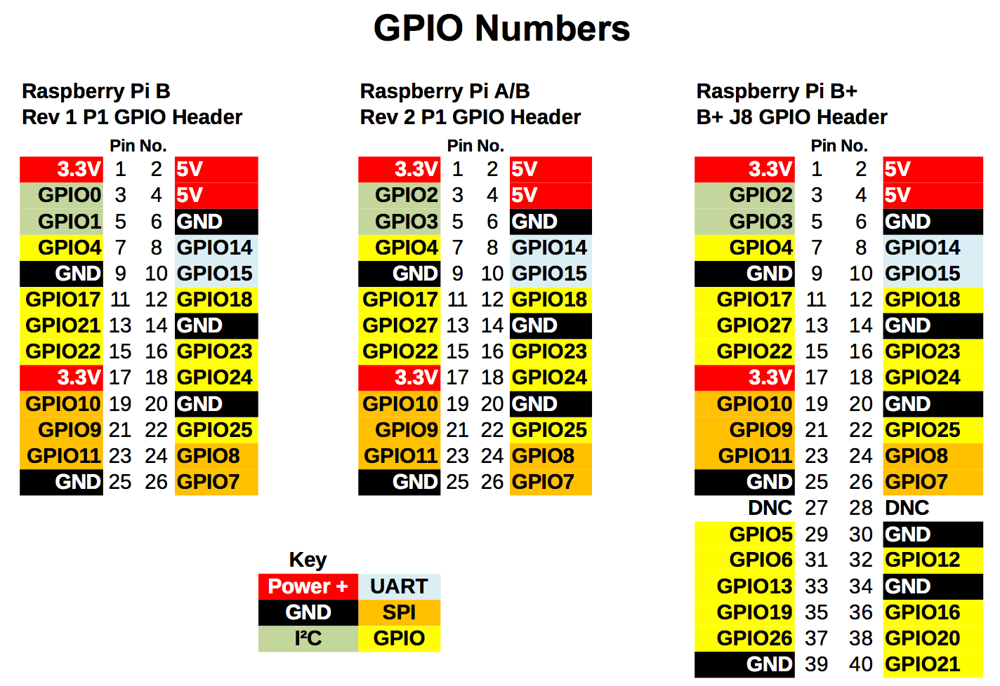
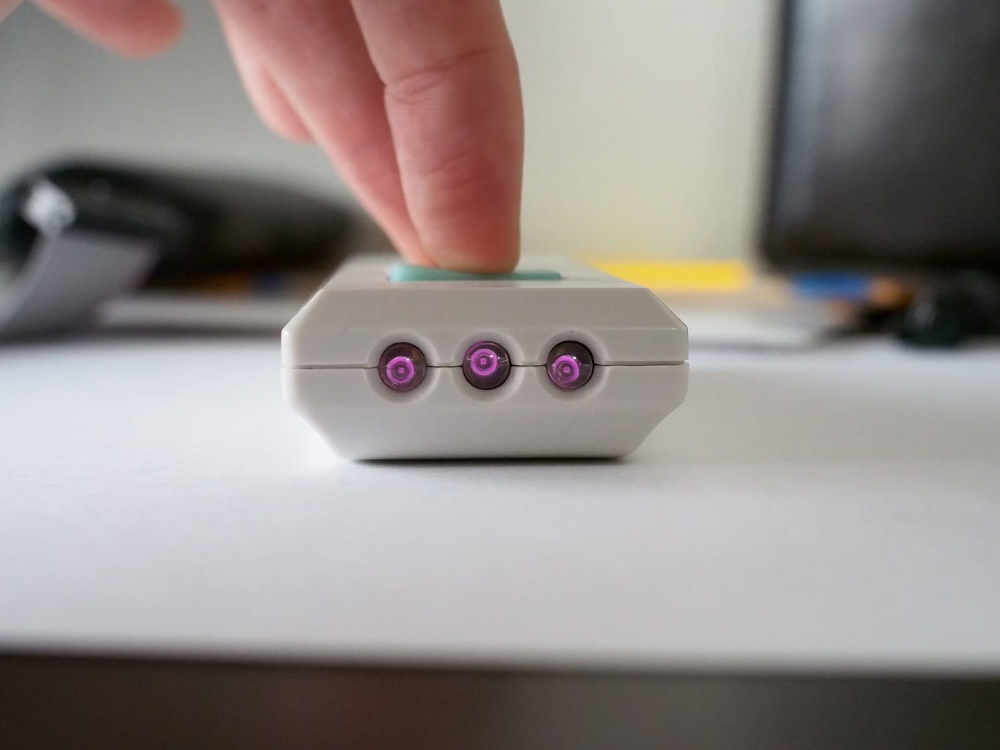
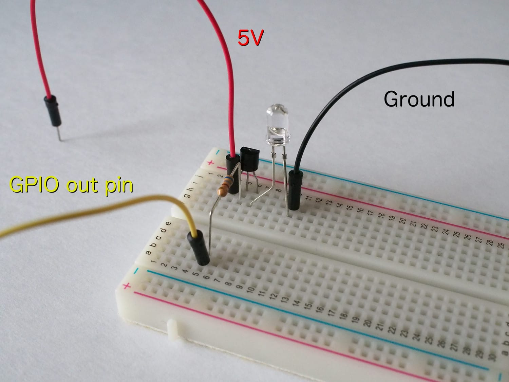
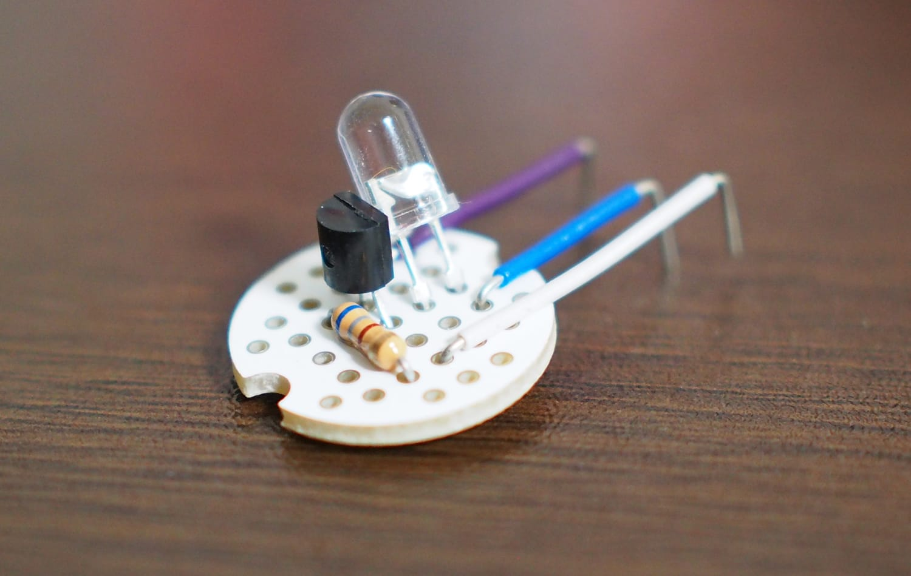
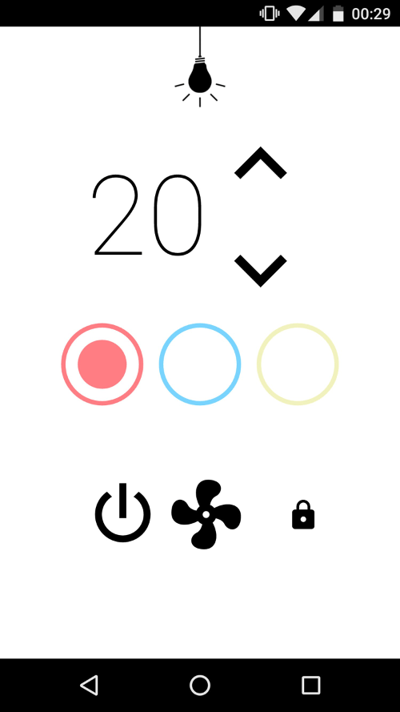
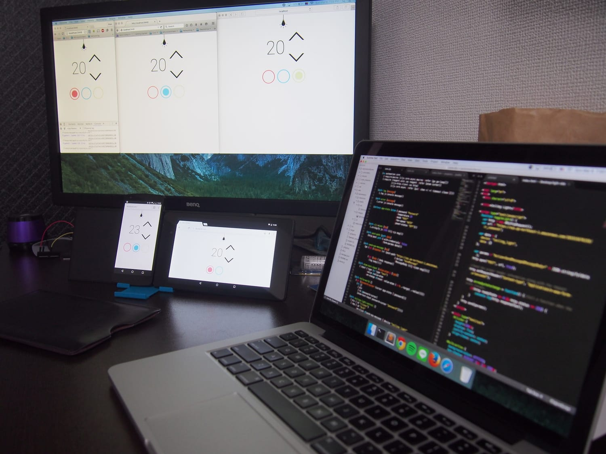

Sending Infrared Commands From a Raspberry Pi Without LIRC
==========================================================

##### May 29th, 2016

**TL;DR** - I made a [small C library](https://github.com/bschwind/ir-slinger) for sending infrared packets easily on the Raspberry Pi, wrote about how to reverse engineer an infrared remote for use in a [home automation server](https://github.com/bschwind/automation-server/), and made a simple infrared LED circuit controlled by the Pi. There's also a bonus [control panel](https://github.com/bschwind/automation-server/blob/master/web/src/automation/core.cljs) written in ClojureScript! If you're frustrated with LIRC, want to send dynamic infrared signals, or want to learn more about how devices communicate with infrared light, read on!

So let's say you have some devices in your home that are controlled by infrared remotes. It could be a TV, an air conditioner, a ceiling light, an Xbox, or really anything you have a remote for. You want to control these things programmatically, but don't know anything about infrared, other than it sends some sort of signal to the devices you want to control. I was in this situation a few months ago and decided to learn about how infrared works and see if I could reverse-engineer my air conditioner and ceiling light. This article documents the steps I took to accomplish this, starting with a Raspberry Pi and ending with a working system to control infrared devices from a web interface from anywhere in the world. In order to better understand the low level details of basic infrared communication, I shunned tools that abstracted these details away, and built a simple LED circuit that connects directly to the Raspberry Pi's output pins.

Note: I try to explain some of these concepts in simple terms, but you'll need some programming experience to make your way through this in its entirety. If you're already familiar with electronics and programming, I might come off as a little patronizing. I just want programmers and non-programmers alike to be able to take something away from this article.

Minimum required components:

* Raspberry Pi (I used Raspberry Pi Revision 1.0, Model B)
* SD Card with Raspbian (I used version 2015-11-21-raspbian-jessie-lite)
* [1 infrared LED](images/darkLED.jpg)
* [1 PN2222 transistor](images/transistorPackCloseup.jpg)
* [1 680 ohm resistor](images/680Resistor.jpg)
* [1 infrared receiver (38 kHz)](images/receiverDataSheet2.jpg)
* [1 solderless breadboard](images/breadboardCircuit.jpg)
* 3 male-to-female jumper cables

Nice to have:
* Programming experience
* Electronics experience (I actually have very little, I just knew the minimum required to get this working)
* [Raspberry Pi ribbon cable](images/ribbonCable.jpg)
* 1 Prototype board
* Solder
* Soldering iron
* More jumper cables
* Patience


Decoding the IR signal
----------------------


I started this project with the simple goal of wanting to turn on my heater on my way home from work so I could come home to a nice warm apartment. I have a [wall mounted heater / air-conditioner](images/resized/airCon.jpg) with an infrared remote control. I didn't know anything about infrared, but I figured there must be a fairly easy way to capture the IR signal and play it back. I wasn't sure exactly what I needed to do this, so I did some research. I came across [this wonderful video](https://www.youtube.com/watch?v=BUvFGTxZBG8) by David L. Jones. In the video, he uses a fancy oscilloscope to view the waveform produced by an infrared remote, and then analyzes it to show us how it works. Infrared turned out to be fairly simple, and the video gave me an idea of the parts I would need to get this project working.

What I got out of the video was the following:

* For most products, an infrared remote is just using non-visible light to send a sequence of 1s and 0s
* To capture an IR signal, you can either use a photo diode (to capture the infrared frequency), or an infrared receiver (to give you a digital 1 or 0)
* Many products operate at 38 kHz and use the [NEC protocol](https://techdocs.altium.com/display/FPGA/NEC+Infrared+Transmission+Protocol)
* A "carrier wave" (for our purposes) is just an infrared light turning on and off very quickly. In this case, 38,000 times a second
* 1s and 0s are encoded by pulsing (turning the LED on and off) at 38 kHz for a particular amount of time, pausing a particular amount, pulsing, pausing, etc. until the full signal has been sent
* When there is no signal, reading the output from the infrared receiver will return a 1. When the LED is pulsing, the infrared receiver returns a 0 (this may be flipped, but for my hardware and OS, a 1 = carrier wave absent, 0 = carrier wave present)

Watch the video a few more times if it doesn't make sense, especially around the 7 minute mark. In essence, the only thing an infrared remote is doing is turning a light on and off very quickly in a particular pattern.

A note on NEC: NEC is not the only infrared protocol, though it's a fairly common one. I'm in Japan and both of my remotes appear to be using it, so this article will focus on NEC. Many of other protocols follow a similar pattern though, and my library can be easily modified to accomodate those.

So with this knowledge, I knew I needed to buy an infrared receiver and some cables to hook up to my Pi. The receiver will let us decode the signals our remotes are sending. I ended up getting this one:




The great thing about these is that you don't need any other components. Just attach the 5V from the Pi to input pin, ground to ground, and an output wire going from the receiver to a GPIO pin on the Pi. Look at the data sheet on your infrared receiver to figure out which wires go where. Here's my data sheet:



So in plain terms, I connect a wire straight from the Raspberry Pi's 5V output to the Vcc pin. The GND pin goes to a ground GPIO pin on the Pi, and the Vout pin goes to a GPIO pin on the Pi which will read the output from the receiver. That's it!

With everything wired up, you can now load Raspbian OS onto the Pi. These steps can vary depending on the platform you're using, so I'll leave it to [raspberrypi.org](https://www.raspberrypi.org/documentation/installation/installing-images/README.md) to provide installation instructions. You can download Raspbian [here](https://www.raspberrypi.org/downloads/raspbian/)

Once you have the SD card with Raspbian inserted in the Pi, you can start it up and configure the OS. Again, these steps can vary, and there are plenty of resources out there to help you out. The end goal is to be able to place files on the Pi and run them. I used SSH, but you could just as easily find a GUI tool to let you do this.

Next step is to pick a remote to decode. To ensure your setup is working, it's best to choose the simplest remote you have. I have an air conditioner and a ceiling light with remotes. The light remote has [just a single button (and it says NEC on the front!)](images/resized/lightRemote.jpg) and was perfect for testing my setup to see if things work. The best kind are those that do not hold any state in them, so find one where you think it would send the same signal every time a button is pressed. The ceiling light I have can be in four different brightness states: High, medium, low, and off. Logically my ceiling light remote would send the same signal every time, because the remote doesn't know what state the light is in. What if I turned the light off with a wall switch? The remote has no way of knowing, so it must send the same signal every time, and the ceiling light (which contains the light state) will interpret that signal as "move to the next lighting state from where you are currently". On the other hand, my air conditioner remote has a screen and it appears to remember what settings you've requested, so it likely sends a different signal each time time I change something. We could also reason that an air conditioner remote which is stateful also sends the *entire* state every time. This is due to the fact that the remote will change its internal state when you press the button, even if the signal didn't reach the air conditioner. Let's say you press the wind speed button to turn the fan up high, and then change the temperature to 22 C. If the first command (wind speed) fails to reach the air unit, but the second command does, the user would still expect the fan speed to be changed to high, because that's what the remote displays on its LCD panel. To be as consistent as possible with what's displayed on the LCD panel, you can conclude that the remote must send its entire state every time a signal is sent (and we'll see later that this is true).

So now that we have a simple remote to test, let's decode the signal! I wrote a Python script to read values from the infrared receiver pin. I found that it runs fast enough to accomplish what we want to do. The goal for recording our remote is to work out the actual 1s and 0s the signal represents, and the rough timings of the pulses. To do this, we will be measuring the times that the signal is pulsing, and the times that it is pausing. The infrared receiver is always outputting a 1 (no signal). When we do a "digital read" on the input pin and receive a 0, that means the infrared receiver picked up an infrared pulse at 38 kHz (because that's the frequency the receiver is rated for). We'll take note of when the receiver first outputs a 0, and measure time until we encounter another 1. If our remote follows the [NEC protocol](https://techdocs.altium.com/display/FPGA/NEC+Infrared+Transmission+Protocol), we should see a roughly 9 millisecond leading pulse. Due to the fact that we're running an interpreted language on a non-realtime OS, the timing values will vary quite a lot, but for the most part they should center on 9 milliseconds.

After the first 9 millisecond pulse, we should see a 4.5 millisecond gap, and then the actual 1/0 signal will start.

Here's the Python script to identify these pulses and print them out. I did my best to explain what's going on in the comments.

```python,main.py
import RPi.GPIO as GPIO
import math
import os
from datetime import datetime
from time import sleep

# This is for revision 1 of the Raspberry Pi, Model B
# This pin is also referred to as GPIO23
INPUT_WIRE = 16

GPIO.setmode(GPIO.BOARD)
GPIO.setup(INPUT_WIRE, GPIO.IN)

while True:
	value = 1
	# Loop until we read a 0
	while value:
		value = GPIO.input(INPUT_WIRE)

	# Grab the start time of the command
	startTime = datetime.now()

	# Used to buffer the command pulses
	command = []

	# The end of the "command" happens when we read more than
	# a certain number of 1s (1 is off for my IR receiver)
	numOnes = 0

	# Used to keep track of transitions from 1 to 0
	previousVal = 0

	while True:

		if value != previousVal:
			# The value has changed, so calculate the length of this run
			now = datetime.now()
			pulseLength = now - startTime
			startTime = now

			command.append((previousVal, pulseLength.microseconds))

		if value:
			numOnes = numOnes + 1
		else:
			numOnes = 0

		# 10000 is arbitrary, adjust as necessary
		if numOnes > 10000:
			break

		previousVal = value
		value = GPIO.input(INPUT_WIRE)
	
	print "----------Start----------"
	for (val, pulse) in command:
		print val, pulse
	print "-----------End-----------\n"

	print "Size of array is " + str(len(command))

```



It just runs in an infinite loop, waiting for a 0 to be read from the infrared receiver. It'll then take note of the time and keep reading 0s and 1s, each time making note of how long a run of 1s or 0s was. Once it reads 10,000 1s, it decides the command has probably ended and returns to the top of the loop. 10,000 is arbitrary and could differ depending on your Pi's CPU speed or other factors, so you may need to adjust it. Once the command has ended, the script will print out the pulses and their durations. Here's some sample output when I ran the script and pressed my light switch remote:

```
0 8982
1 4399

0 631
1 497

0 628
1 1607

0 635
1 490

0 629
1 509

0 627
1 500

0 633
1 500

0 625
1 500

0 624
1 1623

0 629
1 1605

0 622
1 501

0 626
1 1606

0 628
1 1606

0 631
1 499

0 634
1 1605

0 661
1 1569

0 632
1 504

0 626
1 498

0 627
1 1615

0 620
1 496

0 635
1 1614

0 629
1 1599

0 629
1 504

0 625
1 505

0 623
1 516

0 627
1 1598

0 631
1 501

0 625
1 1606

0 627
1 501

0 636
1 496

0 626
1 1609

0 630
1 1606

0 628
1 1607

0 623
```

I was thrilled to find this matches up very nicely with the NEC protocol! You can see the 9 ms pulse at the beginning, followed by the 4.5 ms gap. The script is off by several hundred microseconds but it's close enough to see what's going on. The next step is to convert this series of pulses to binary.

The basics of the [NEC protocol](https://techdocs.altium.com/display/FPGA/NEC+Infrared+Transmission+Protocol) are simple:
* A "logical 0" is a 562.5 microsecond pulse, followed by a 562.5 microsecond gap.
* A "logical 1" is a 562.5 microsecond pulse, followed by a 1687.5 microsecond gap.

Keep in mind that in my pulse list above, a 0 is a pulse, and a 1 is a gap. So to start, chop off the leading 9 ms pulse and the 4.5 ms gap and then read the lines two at a time. The first two entries are:

```
0 631
1 497
```

That's a roughly 565 pulse followed by a 565 gap, so this is a 0. Next is:

```
0 628
1 1607
```

A 565 pulse followed by a 1687 gap (you can start to see why the numbers don't need to be exact). This is a 1. Next:

```
0 635
1 490
```

565 pulse followed by a 565 gap, that's a 0. And so on. Notice the signal also has a trailing 565 pulse at the end. Some signals have this, some don't, but the NEC protocol suggests that the signal *should* have it. We end up with

```
01000001101101100101100010100111
```

I did this one by hand, but for my air conditioning remote, you can imagine it getting tedious. The algorithm to convert these pulses into binary is pretty straightforward and it's simple enough to adapt our Python script to do it for us. We can use the heuristic that any gap over 1000 microseconds is likely a logical 1, otherwise it's a logical 0. Looking at the data, we can see that this is sufficient to distinguish the two. You could even write a cutesy one-liner to convert this "command" array into a binary string:

```python
binaryString = "".join(map(lambda x: "1" if x[1] > 1000 else "0", filter(lambda x: x[0] == 1, command)))

```

In the script, `command` is an array of tuples of the structure (pulse_value, pulse_duration) where pulse_value is a 0 or 1, and pulse_duration is an integer in microseconds. We filter this array to only include the gaps (`x[0] == 1`) because the gap is what distinguishes a 1 from a 0. Then we map all gaps with a duration (`x[1]`) greater than 1000 to be a "1", otherwise a "0". All those 1s and 0s are then joined together to form the binary string.

If we group this binary string into bytes, we can see the structure of the signal a little more easily:

```
01000001
10110110
01011000
10100111
```

One thing the NEC protocol mentioned is that the second byte should be the inverse of the first, and the fourth byte an inverse of the third. At first I thought I did something wrong, but it turns out my remote doesn't follow the standard. So that's great! We decoded the signal, and it even looks like an NEC protocol infrared signal. At this point, to test that I decoded it correctly, I wanted to run the command through LIRC (Linux Infrared Remote Control). This package lets you define static commands in hexadecimal in a config file, and then you can send them from the command line.

Here's the conversion of the binary string to both decimal and hex

```
Binary      Decimal      Hex
01000001    65           41
10110110    182          B6
01011000    88           58
10100111    167          A7

Final: 0x41b658a7
```

Sending the IR signal
---------------------

If you google around for "raspberry pi send infrared", you get almost exclusively results talking about LIRC. And unfortunately I'm probably going to add another result to the pile. I say "unfortunately" because I had a horrible experience with it. The configuration files are confusing as hell and don't seem to support comments correctly, the website is very old and extremely unhelpful when just trying to figure out how to even use it, the capture tool didn't work properly for me, and worst of all, it only seems to support static codes. A remote that keeps its own state and sends dynamic signals based on that state are not supported. There goes any hope of supporting my air conditioner, unless I wanted to settle for static presets, and that's no fun.

I mean, just look at [all this ridiculous config file ceremony](http://alexba.in/blog/2013/01/06/setting-up-lirc-on-the-raspberrypi/) to get the thing set up. I found the whole process of decoding the signals and writing code to send it to be more straightforward than messing around with some crazy config file, guessing at what flags I need to set, and what config files need to tweaked in just the right way. I ended up finding the documentation for *some* of the config files on [an old page for WinLIRC](http://winlirc.sourceforge.net/technicaldetails.html) that explained at least a little bit, but was stingy with details. LIRC was *not* a pleasant tool to work with, it's too cumbersome and limited with its static config files.

Also, this

> If the comment character (#) appears as the first character on a line the rest of the line is ignored.

is infuriating. If the # character is the first non-whitespace character on the line, but it is not the *first* character, LIRC will complain about syntax issues with the config file (or it'll just crash, I forget and I don't care).

However, by some miracle, I didn't give up and tried enough permutations that I bruteforced my way to a working config. [Results here](https://www.youtube.com/watch?v=aiJjoJHIRZY)

In the video you can actually see our hex code contained in the config file I was editing with one hand. Great, it works! I even have a [small writeup](https://github.com/bschwind/rpiStuff/tree/master/irTransmitter) on getting LIRC working if you're into that.

Now how the hell do I do this without the madness of LIRC? Why do we even need LIRC to begin with? Can't we just write a python script and turn the pins on and off, kind of like how we were reading from the infrared receiver? Good question but no, you can't.

In order for infrared to work properly, you need a pretty consistent 38 kHz signal to be generated. That means you need to go through an entire on/off cycle every 1/38000 seconds, or roughly every 26 microseconds. That's no problem, you think. Even the first Raspberry Pi had a 700 MHz CPU, more than fast enough to change a pin on and off at 38 kHz. But you don't get all that 700 MHz to yourself. You have to run the OS, which takes quite a sizable chunk of that processing speed away. Then you have the fact that you're running Python, an interpreted language that might run a garbage collector at any time, delaying your code unpredictably. And even a compiled program written in C or C++ could be interrupted by the operating system, as your program is not the only thing running and the OS will stop your program to give other programs a chance to run. So you might get the correct speed with C, but the OS interruptions means you won't get a consistent wave, and thus the signal won't work, or it won't work reliably.

So how does LIRC get away with it? I don't know the exact terminology, but it uses something like a "kernel module" or "kernel extension" that runs at the same level as the operating system. In other words, it runs on the bare CPU and can do whatever the OS can. By doing this, it can prevent itself from being interrupted by the OS, which means it can generate a consistent signal on the Pi's GPIO pins. I'm not sure if there's a time limit to how long it can do this, but it definitely has enough time to send an infrared signal. In the video I linked at the beginning, he used an Arduino to send the signal. An Arduino doesn't have a big time-slicing OS running on it to interrupt your program, so it can get away with just generating the signal as you would with a Python script (except Arduino runs a version of C). But I wanted to run everything on a Pi because of its networking capabilities and the fact that I can use practially any language I want. I *could* attach an Arduino to the Pi, but then I'd have to power two microcontrollers and it's just a clunky solution. I could alternatively use an Arduino with a Wi-Fi adapter, but then I'd lose the convenience of having a full-blown and well-supported Linux environment like the Pi provides.


A better way to send IR signals (pigpio)
----------------------------------------


With that high level understanding of LIRC, I did some searching and came across a library called [pigpio](http://abyz.co.uk/rpi/pigpio/index.html). What caught my eye was this sentence on the feature list:

> the construction of arbitrary waveforms to give precise timing of output GPIO level changes (accurate to **a few microseconds**).

Perfect! So what this means is pigpio, among other things, is a library that will let us build up the infrared wave ahead of time and hand it off to be transmitted in a kernel extension where it won't be interrupted. There are some limits to the size of the wave we can transmit, but you can recompile pigpio to make those limits higher, and I found that my remote's signal fits entirely in the default wave size of pigpio.

I found pigpio to be a fantastic library, and it gets bonus points for being a C project that builds on the first try. Thank you, joan2937, you've made a super helpful library and this project wouldn't have been nearly as pleasant without it.

pigpio offers a ton of functionality, but I was only interested in generating waveforms with microsecond timing. I set out to create a wrapper library that is just designed for sending an infrared signal on a Pi's GPIO pin and nothing fancier than that. I wanted to be able to specify the pin, the pulse frequency, and the timing values for infrared pulses since the timing on remotes can vary. I also wanted it to accept a binary string to send, to make it easy to use it with dynamic infrared codes. I ended up creating [ir-slinger](https://github.com/bschwind/ir-slinger) to accomplish this. It just has one function, irSling(), which takes in all the pulse parameters, a GPIO pin number, and a binary string, and it will do its work to set up the infrared wave and send it over the pin. pigpio has tons of other features and even has the ability to output the signal on multiple pins at once. I decided to simplify my library to just work on one pin at a time but it can easily be modified to support multiple pins.

I'm not going to go into too much detail with the C library. It's a header-only library, so just include it in your own program and pass a few linker flags to the compiler. Those flags are documented in the README. Instead of making one executable that takes in a billion parameters, I settled on making an executable per infrared device I have, and hard coding the pulse parameters in the code itself. For example, this is the entire source code for the ceiling light program:

```c,main.c
#include <stdio.h>
#include "irslinger.h"

int main(int argc, char *argv[])
{
	uint32_t outPin = 23;            // The Broadcom pin number the signal will be sent on
	int frequency = 38000;           // The frequency of the IR signal in Hz
	double dutyCycle = 0.5;          // The duty cycle of the IR signal. 0.5 means for every cycle,
	                                 // the LED will turn on for half the cycle time, and off the other half
	int leadingPulseDuration = 9000; // The duration of the beginning pulse in microseconds
	int leadingGapDuration = 4500;   // The duration of the gap in microseconds after the leading pulse
	int onePulse = 562;              // The duration of a pulse in microseconds when sending a logical 1
	int zeroPulse = 562;             // The duration of a pulse in microseconds when sending a logical 0
	int oneGap = 1688;               // The duration of the gap in microseconds when sending a logical 1
	int zeroGap = 562;               // The duration of the gap in microseconds when sending a logical 0
	int sendTrailingPulse = 1;       // 1 = Send a trailing pulse with duration equal to "onePulse"
	                                 // 0 = Don't send a trailing pulse

	int result = irSling(
		outPin,
		frequency,
		dutyCycle,
		leadingPulseDuration,
		leadingGapDuration,
		onePulse,
		zeroPulse,
		oneGap,
		zeroGap,
		sendTrailingPulse,
		"01000001101101100101100010100111");
	
	return result;
}

```

If you save that as `test.c`, it can be compiled on the Pi with `gcc -o light test.c -lm -lpigpio -pthread -lrt` and you'll get an executable file called `light` if everything compiled. This assumes pigpio is installed on your Pi, see the [github repo](https://github.com/bschwind/ir-slinger) for more detailed steps on getting this working.

This executable can then be easily called on the command line or as a child process from another language (which is exactly what I do...more on that later).

So to recap, we learned about the NEC infrared protocol, used an infrared receiver to decode the signal a simple remote is sending, and then found and used a cool C library to allow us to send arbitrary signals. Every time we run the program above, it sends the signal one time to my ceiling light. The final missing piece is the actual circuit you need to connect to the Pi to get an infrared LED blinking. I'm an electronics rookie so I can't speak authoritatively on this part of the project. I put something together that works, but I'm sure an actual EE could make it more robust (and do a better soldering job). I'm very open to any improvements that can be made!


A basic infrared LED circuit
----------------------------

With that being said, this is a simple thing we're doing, just turning an LED on and off. It's a basic electronics project. At first I thought I could just hook the LED up to the GPIO pin directly (with a resistor to limit the current), but it turns out the GPIO digital outputs don't have enough current to get the LED to the right brightness levels. The Pi has a 5 volt output pin which can provide enough current, so I wanted that output to go through the LED. You can't just hook up the 5 volt line straight to the LED though, because then the LED would always be on and useless for our purposes. We want to turn that 5 volt source on and off according to our infrared signal, but you can't (or just shouldn't?) directly turn the 5 volt pin on and off. This is the perfect use case for a transistor. A transistor will let you apply a small current from a Pi's GPIO pin and when that small current is present, it allows electricity from the 5 volt pin to flow through. If the small current is absent, the stronger current can not pass through the transistor. This is a simplified explanation, as there are cases when the stronger current would make it through the transistor, but if your parts are picked correctly and the circuit is wired up properly, that is how it should work.

So my final circuit now involves an infrared LED, a PN2222 transistor, and a 680 ohm resistor because the transistor [needs a resistor at the base pin](https://learn.sparkfun.com/tutorials/transistors) (where the GPIO pin switches the 5 volt signal on and off). I knew that an LED typically should have a resistor to limit the current going through it as you don't want to burn it out. However, I wanted the strongest signal possible, and using a resistor would reduce the brightness of the LED. I also thought that since I was pulsing the LED and not just turning it on for extended periods of time, it would be okay. That worked fine...for about 60 days, and then it burned out. Or perhaps my crappy soldering job gave up. The LED still emits a very faint signal, so I'm not sure which is the case. I created an alternate circuit with a 39 ohm resistor to limit the current through the LED, but it turned out to be too weak for my devices to pick up. Any electronics experts want to chime in and tell me what you'd do to make this circuit better? I would love to build a better one. For now I just swapped out the LED with a slightly different one which I think can handle slightly more voltage.

Tip: You can see if an infrared LED is emitting light by looking at it through your phone camera, most can pick it up. Otherwise you could spend hours diagnosing issues and not know what's going on.



Here is my final circuit on a solderless breadboard, and the same circuit on a smaller scale:






I could take this a step further and design a PCB with proper header pins, maybe someday!


Decoding a dynamic IR remote
----------------------------

Dealing with my ceiling light remote was easy -- there's only one button! It sends the same signal every time, and the signal can be short because it doesn't need to carry much information. On the other hand, my air conditioning remote is a lot more complicated:


It has a button for mode (heating, cooling, dehumidify), air temperature, on/off timer, fan direction, fan speed, and one for turning the whole thing off. I immediately decided against decoding the timer functions because if I have the ability to send these codes from software, I can get much more fine-grained timing.

I started the decoding process for this remote by writing a python script as I mentioned above that converts the pulse/timing data into binary strings. So instead of getting a huge amount of pulse data dumped to the screen, I get a binary string for every button press. From there it's a matter of changing one variable at a time and seeing what parts of the binary string change. The first thing I wanted to figure out was how the temperature is encoded. I figured since the remote is sending a binary string, the number would be encoded in straightforward binary, and that turned out to be correct. I kept all other variables constant, and changed the temperature from 25 c, to 24, then to 23, with the resulting binary strings:

```
25 c - 100000000000100000000000000000101111110111111111000000000011001111001100010010011011011011001000001101110010011011011001000000001111111100000000111111110000000011111111000000001111111100000000111111110110101010010101100010110111010000000000111111110000000011111111
24 c - 100000000000100000000000000000101111110111111111000000000011001111001100010010011011011011001000001101110000011011111001000000001111111100000000111111110000000011111111000000001111111100000000111111110110101010010101100010110111010000000000111111110000000011111111
23 c - 100000000000100000000000000000101111110111111111000000000011001111001100010010011011011011001000001101110011101011000101000000001111111100000000111111110000000011111111000000001111111100000000111111110110101010010101100010110111010000000000111111110000000011111111
```


I found the area where the temperature was being encoded by just looking for differences in the string. This was a manual process, but if I were faced with hundreds of codes to analyze, I'd write a script that would assist with this. Here are the same codes, with the temperature data isolated:

```
25 c - 10000000000010000000000000000010111111011111111100000000001100111100110001001001101101101100100000110111 00100110 11011001 000000001111111100000000111111110000000011111111000000001111111100000000111111110110101010010101100010110111010000000000111111110000000011111111
24 c - 10000000000010000000000000000010111111011111111100000000001100111100110001001001101101101100100000110111 00000110 11111001 000000001111111100000000111111110000000011111111000000001111111100000000111111110110101010010101100010110111010000000000111111110000000011111111
23 c - 10000000000010000000000000000010111111011111111100000000001100111100110001001001101101101100100000110111 00111010 11000101 000000001111111100000000111111110000000011111111000000001111111100000000111111110110101010010101100010110111010000000000111111110000000011111111
```

Here they are again with just the binary strings that differ:

```
25 c - 00100110 11011001
24 c - 00000110 11111001
23 c - 00111010 11000101
```

I grouped these in bytes. Remember how the NEC protocol will often send a binary string, and then the inverse of that string? The same thing seems to happen on a byte-level in this string. For 25 c, we have "00100110" and its inverse, "11011001". For this temperature byte, let's ignore the inverse and just look at the first byte: 00100110. All of the observed temperature bytes seem to have two leading 0s, so I chopped those off:

```
100110
```

At first I tried to read the byte from right to left because I'm just used to having the least significant byte on the right. Converting to decimal gives:

```
5   4   3   2   1   0
1   0   0   1   1   0

 5           2   1
2 + 0 + 0 + 2 + 2 + 0 = 32 + 4 + 2 = 38
```

38 is way too hot for a heater (not to mention it doesn't seem related to 25, which is the current temperature), so I tried starting from left to right:

```
0   1   2   3   4   5
1   0   0   1   1   0

 0           3   4
2 + 0 + 0 + 2 + 2 + 0 = 1 + 8 + 16 = 25
```

There we go! Let's verify the code from 23 c, just to be sure:

```
0   1   2   3   4   5
1   1   1   0   1   0

 0   1   2       4
2 + 2 + 2 + 0 + 2 + 0 = 1 + 2 + 4 + 16 = 23
```


It gets tedious, but that's basically all there is to it. Keep changing one variable at a time, take note of your current state, record the binary strings, then compare the bits until you find where they differ. I was interested in the temperature, mode (heat, cool, dry), and fan speed. My full analysis is [here](https://github.com/bschwind/rpiStuff/blob/master/irTransmitter/airConRemote.txt)

Constructing the signal in code
-------------------------------

Ignoring the on/off timer part of the signal, you can construct the full signal with this code (JavaScript):

```javascript,constructSignal.js
function getIRCodeFromState(state) {
	var code = "1000000000001000000000000000001011111101111111110000000000110011110011000100100110110110";

	// Button category
	switch (state.button) {
		case "UP/DOWN":
			code += "0010001011011101";
			break;
		case "MODE":
			code += "1100100000110111";
			break;
		case "FAN_SPEED":
			code += "0100001010111101";
			break;
		case "FAN_DIRECTION":
			code += "1000000101111110";
			break;
		default:
			code += "1100100000110111"; // MODE
			break;
	}

	// Temperature code
	var temperatureCode = binaryUtil.decimalToBinary(state.temperature);
	temperatureCode = temperatureCode.split("").reverse().join("");
	temperatureCode = "00" + temperatureCode + "0";
	temperatureCode += binaryUtil.inverseBinaryString(temperatureCode);

	code += temperatureCode;

	// Timer-specific code. This means no timer has been set.
	code += "00000000111111110000000011111111000000001111111100000000111111110000000011111111";

	// Mode
	var modeFanString = "";
	switch (state.mode) {
		case "HEAT":
			modeFanString += "0110";
			break;
		case "DEHUMIDIFY":
			modeFanString += "1010";
			break;
		case "COOL":
			modeFanString += "1100";
			break;
		default:
			modeFanString += "1010"; // Dehumidify
			break;
	}

	// Fan speed
	switch (state.fan_speed) {
		case "AUTO":
			modeFanString += "1010";
			break;
		case "STRONG":
			modeFanString += "0010";
			break;
		case "WEAK":
			modeFanString += "1100";
			break;
		case "VERY_WEAK":
			modeFanString += "0100";
			break;
		default:
			modeFanString += "1010"; // AUTO
			break;
	}

	code += modeFanString;
	code += binaryUtil.inverseBinaryString(modeFanString);

	if (state.power_status === "ON") {
		code += "100010110111010000000000111111110000000011111111";
	} else {
		code += "100000110111110000000000111111110000000011111111";
	}

	return code;
}

```

Given a state object, such as

```JavaScript
{
	mode: "HEAT",
	temperature: 23,
	fan_speed: "AUTO",
	power_status: "ON",
	button: "MODE"
}
```

the function above will return the binary string we need to send through our infrared LED. At this point, it's a matter of knowing the parameters for the NEC protocol, and using the ir-slinger library I made earlier. I guessed that the frequency would be 38 kHz since that is common. Through some measurements of the signal with my python script, I found the following parameters:

```
leadingPulseDuration = 3500 microseconds
leadingGapDuration = 1600 microseconds
onePulse = 400 microseconds
zeroPulse = 400 microseconds
oneGap = 1300 microseconds
zeroGap = 450 microseconds
sendTrailingPulse = 1
```

I wrote a simple C program that hard codes these parameters, but takes a binary string as an argument. This way I can send arbitrary commands that my air conditioner will understand, and then I have control over it!

Sending commands from the Internet
----------------------------------

Now I can use that signal construction code and my C library to build and send infrared signals while using the Pi locally. But my main use case for this project was to turn on my heat ahead of time while coming home from work. It needs to work from anywhere on the internet.

At first, my plan was to expose an HTTP server on the Pi, and use my router to forward a particular network port to the Pi. This was stopped pretty quickly though, because I have an internet connection that came with my apartment, and it seems most incoming connections are dropped somewhere before my router. I can't access or configure that part, so accessing the Pi from the outside would be tough. I could use a VPN or some kind of service like [https://ngrok.com/](https://ngrok.com/), but I decided to try out something else.

With an IR remote, you store local state. When you press a button, it changes the state on the remote and sends that new state out as an infrared signal. The remote does not receive any response from the device. In practice, I could do the same thing. It would be *nice* to get a response with the current state of the device, but it's not necessary. So keeping in mind that I don't neccessarily need two-way communication, I thought of Amazon SQS as a way to provide one-way commands that can access the Pi. Amazon SQS stands for Simple Queue Service. It's a message queue that you can throw messages onto, and one of many devices can receive a message from the queue and process it, or put it back in the queue if the device can't handle it. It works by having a client send a command to a known URL (the URL of the SQS queue), and a "worker" polling that same URL for new messages.

So what I could do is write a web interface (or a native android/ios app) that posts JSON messages to the queue's URL. Then the Pi would be continuously monitoring that queue for new messages. When it receives a message that is properly formatted, it can extract the data and use it to send a command. Simple! I was actually really pleased with this idea because it requires no network changes on my end, and protects the Pi from being exposed to the Internet at large. The only things getting in from outside are SQS messages, and those can also be locked down so only clients with the right authentication can send messages. The disadvantage is that the clients don't receive any feedback from the Pi, though I could work around that by having the Pi post its latest state to AWS S3 (Simple Storage Service). I ended up using the SQS method for passing data to the Pi and so far it's been great! I expected the latency to be kind of bad, but it's actually quite fast considering all the hops involved from phone to Pi.


The server
----------

I wrote the server with NodeJS because it's quick, easy, and is fast enough for what I wanted to do. The source code can be found [here](https://github.com/bschwind/automation-server/). The server originally (and still does) have an HTTP API exposed on the local network that I can use to control my light and air conditioner, but the UI I made talks to the Pi through SQS. In the future, if I make an Android app then it can detect when it's on my wifi network and use the local HTTP API to query the current state of my devices. The server keeps a history of air conditioner states in an SQLite database, is responsible for routing queue messages to the correct device, constructing IR codes, and actually sends the IR signal by starting a child process. Instead of having one executable on the Pi that takes in a ton of parameters, I made two separate ones: `ceiling-light` and `aircon`. `ceiling-light` has everything hardcoded, you just call it and it sends a signal to my light. `aircon` takes a binary string as an argument and sends that to the air conditioner (with hardcoded timing values). I just call these from Node with the child_process module, which was straightforward and quick to implement. It's a pretty simple server and isn't the focus of this article, so I won't go into much more detail than that. I'm pleased with the design though, I can see myself easily adding other infrared devices into this code.

One thing to note is the security of this setup. Currently, the queue accepts messages from anyone, but only the Pi can pull messages off of it. Additionally, the client must send a password along with any messages sent to the queue. The pi will only act on messages that have the correct password (which can be arbitrarily chosen). An attacker doesn't get any feedback on whether or not the password is correct, so there's little to be gained by trying to bruteforce it. I could go a step further and only allow specific users to send messages to the queue, and I'll probably have to do that before posting this article... It's not a perfect security setup by any means, but it's enough to prevent random people from turning your apartment into a furnace.

The web interface
-----------------



This was one of my favorite parts of the project aside from getting the actual infrared signals working. I was originally going to make an Android home screen widget (and I may still do that), but I don't particularly enjoy Android programming so I settled on making a web interface first. I just needed an interface that acted like a remote. You press buttons, state changes, and a command is sent. So it needed a bit of interactivity, but nothing too fancy. I ended up trying out ClojureScript and a small library called [Reagent](https://reagent-project.github.io/) to handle updating the views as buttons are pressed. The entirety of the UI logic is contained in [one nice file.](https://github.com/bschwind/automation-server/blob/master/web/src/automation/core.cljs)

I loved the speed of development I could achieve with ClojureScript, and it was fun seeing live code changes appear on multiple devices at once with the help of Figwheel, an excellent plugin to Clojure(Script)'s build system.



I got the bare minimum set up so I could turn my light and air conditioner on and off, change the temperature, change the mode from heating to cooling, and enter the password needed for the server to accept the messages. By the time I got this functionality set up, I was basically satisfied and got a bit lazy about implementing the rest (such as the fan speed control). I finished what I set out to do though, which was to reverse engineer my infrared devices and control my heating/cooling remotely. It's not often I finish a personal project from start to finish so I'm very pleased with this one, and I hope my ir-slinger library can be helpful to others who want to do something similar.
